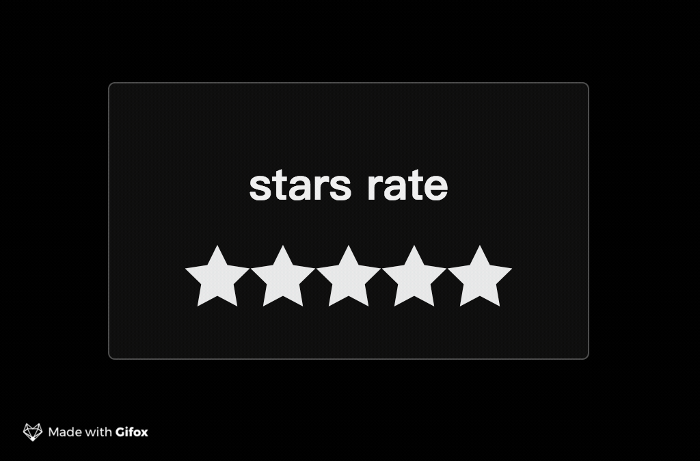

**需求**
1. 定义一个函数rater,调用这个函数就能创建评分组件
2. rater函数接收对象作为参数，具体对象属性如下
   * starSize：数字  可以设置星星的大小
   * element：dom节点 要把这个组件渲染到哪个dom节点上
   * max：数字 要显示星星的数量
   * showToolTip：布尔型 当hover的时候是否显示提示框

**提示**

资料当中有html和css 展示了静态的评分组件 js需要动态改变评分组件

